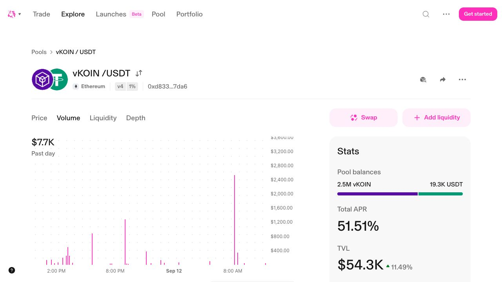
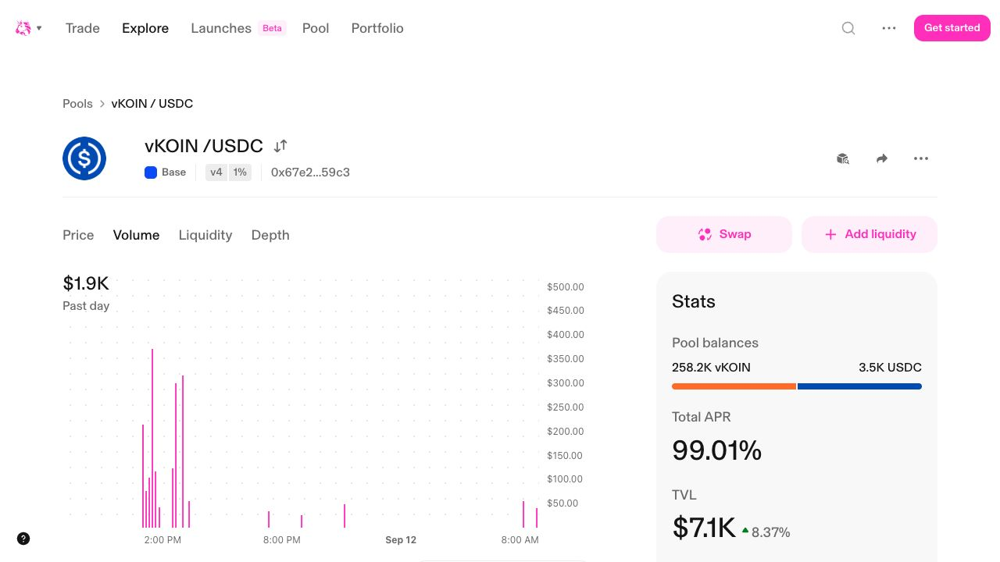
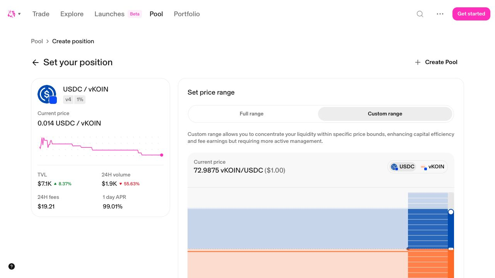
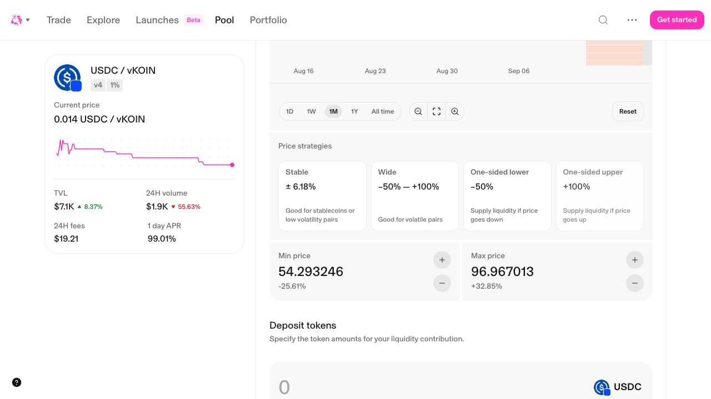

# How to Add vKOIN Liquidity on Uniswap and Raydium

## A practical guide for Ethereum, Base, and Solana

Adding liquidity allows other people to buy and sell a token on a decentralized
exchange. In return, the liquidity provider may receive a share of the fees
generated by swaps. However, it is not an investment with guaranteed returns:
the composition and value of the position can change, and you may lose money.

This guide explains how to add **vKOIN** liquidity to existing **Uniswap v4**
pools on Ethereum and Base and an existing **Raydium CLMM** pool on Solana. It
does not explain how to create a new pool or recommend how much to deposit or
which price range to choose.

> **Important:** Providing liquidity involves market, smart contract, wrapped
> token, and bridge risks. Start with a small amount you can afford to lose and
> verify all the details before signing.

> **About the screenshots:** The Uniswap screenshots in this article were
> captured from the public interface on September 12, 2026, with no wallet
> connected. Pool balances, volume, fees, prices, and APR figures are
> time-sensitive examples—not promised or expected returns. Always rely on the
> current interface and verify the full addresses yourself.

## What does adding liquidity mean?

A decentralized exchange such as Uniswap does not need to wait for a specific
buyer and seller to appear before executing each trade. Swaps take place
against pools: smart contracts that keep two assets available.

For example, the Ethereum pool used in this guide contains **vKOIN and USDT**.
The people who supply those assets enable other users to swap vKOIN for USDT or
USDT for vKOIN.

When you add funds, you receive a **liquidity position** representing your
contribution. In Uniswap v4 and Raydium CLMM, ownership of that position is
represented by an NFT. The address controlling that NFT can manage the position
and collect accrued fees. Do not send the NFT to someone else: transferring a
position NFT can also transfer control of its liquidity.

## Why is liquidity important?

More liquidity can improve how a market works:

- it makes it easier for users to buy and sell without waiting for a
  counterparty;
- it reduces the effect a trade has on the price;
- it reduces the difference between the expected and final execution price;
- it allows larger amounts to be traded with less distortion; and
- it reduces dependence on centralized exchanges.

Liquidity providers make that market possible and may receive a share of its
swap fees. However, those fees do not guarantee a profit and may be lower than
the losses or costs involved in managing the position.

## Before you begin: KOIN and vKOIN are not the same

**KOIN** is the native token of the Koinos blockchain. It is held in a Koinos
wallet and provides mana for transactions on that network.

**vKOIN** is a wrapped representation of KOIN used on other networks:

- On Ethereum, vKOIN is issued through Vortex.
- On Base and Solana, vKOIN comes from Ethereum through Portal (Wormhole),
  adding another bridge dependency.

vKOIN does not provide mana and cannot be sent directly to a Koinos address to
convert it into KOIN. You must also never send native KOIN to an Ethereum, Base,
or Solana address.

The official vKOIN contract addresses and mint used in this guide are:

| Network | Asset | Contract address or mint |
| --- | --- | --- |
| Ethereum | vKOIN | [`0xa50ad3a559A10f384a5bB2e27516f63E0B937b1A`](https://etherscan.io/token/0xa50ad3a559A10f384a5bB2e27516f63E0B937b1A) |
| Base | vKOIN | [`0x9b61660Cb1a6920E9c912570cD210020B956F34E`](https://basescan.org/token/0x9b61660Cb1a6920E9c912570cD210020B956F34E) |
| Solana | vKOIN | [`8AUxdPqYU4FBy5rZDhMJxTniPs7gtEfdHjP3UKM71m6G`](https://solscan.io/token/8AUxdPqYU4FBy5rZDhMJxTniPs7gtEfdHjP3UKM71m6G) |

Do not rely only on the name or logo. Anyone can create a token called vKOIN.
Always verify the complete contract address or mint.

If you do not yet have vKOIN, first read the Koinos guide on
[how to buy KOIN](https://koinos.io/get-koin).

## Choose the correct network and pool

This guide covers three separate markets. Assets on one network do not
automatically appear on another, and each pool has its own balances, activity,
and liquidity providers.

| Network | Venue and type | Pool | Trading fee | Full pool ID |
| --- | --- | --- | --- | --- |
| Ethereum | Uniswap v4 | vKOIN / USDT | 1% | `0xd833a3afa936ca389966a9ed3a3d9abf7ec45c11b0d575aaaf6ca4d354687da6` |
| Base | Uniswap v4 | vKOIN / USDC | 1% | `0x67e2b4bf9917e1ab76bff55dbe125d27858c04bfe77da71b8721d526059859c3` |
| Solana | Raydium CLMM | vKOIN / WSOL | 1% | `2kbZSkxa3M7VAWMnZDqBNarkFFBYUyskeavXnq1oK3gT` |

In Uniswap v4, these 32-byte values are **pool identifiers**, not separate
contract addresses. The Uniswap interface may shorten them on screen, so compare
the complete identifier in the page URL with this guide.

### What are Ethereum and Base?

[Ethereum](https://ethereum.org/developers/docs/intro-to-ethereum/) is an
independent Layer 1 blockchain. Its nodes agree on the state of the Ethereum
Virtual Machine (EVM), which executes smart contracts. **ETH** is Ethereum's
native asset and pays for transaction execution. Fungible tokens such as vKOIN
and USDT are normally implemented as ERC-20 smart contracts, each identified by
its own contract address.

[Base](https://docs.base.org/get-started/base) is an Ethereum Layer 2 network
built by Coinbase. It is a separate blockchain network, not the Coinbase
centralized exchange. Base is a standard EVM chain, so Ethereum tools, wallets,
and smart contracts can work with it. Under the hood, a sequencer orders Base
transactions into Layer 2 blocks and submits batches for data availability; the
Base chain is then derived from Ethereum Layer 1 data and those sequencer
batches.

An Ethereum-compatible wallet such as MetaMask or Rabby can normally use the
same `0x` account address on Ethereum and Base. However, the networks keep
separate balances and transaction histories. Seeing ETH, USDC, or vKOIN on
Ethereum does not mean that the asset is also available on Base, even when the
wallet address looks identical.

Transactions on Base use **ETH on Base** to pay network costs. ETH held only on
Ethereum cannot pay for a Base transaction. Assets must arrive on the correct
network through a withdrawal service that explicitly supports Base or through
an appropriate bridge. Bridging introduces additional smart contract and
operational risks, so verify the destination network and send a small test
amount first.

Base Mainnet has chain ID [`8453`](https://docs.base.org/get-started/connect-to-base).
Your wallet should display **Base** before you interact with the Base pool. Also
remember that vKOIN uses a different contract address on Base than it does on
Ethereum.

### What are Solana and WSOL?

[Solana](https://solana.com/docs/core) is a separate Layer 1 blockchain. It is
not an Ethereum Layer 2 and it does not use the EVM. Solana smart contracts are
called **programs**; programs receive instructions and read or change data held
in separate accounts. Solana accounts are identified by 32-byte addresses,
which look different from Ethereum's `0x` addresses.

This architectural difference also changes the user experience:

- Solana requires a Solana-compatible wallet and a Solana address. A wallet such
  as Phantom or Solflare is commonly used, while MetaMask or Rabby are common
  choices for Ethereum and Base. These are examples, not endorsements.
- **SOL** is Solana's native asset, and every Solana transaction requires a fee
  paid in SOL. ETH cannot pay a Solana transaction fee.
- Fungible assets on Solana use the SPL Token or Token-2022 programs. A token is
  identified by its **mint address**, and a wallet uses separate token accounts
  to hold each token. The Solana vKOIN mint is therefore not an ERC-20 contract.
- Solana has its own validator network and transaction history. Ethereum and
  Base balances do not appear there automatically.

Raydium is a decentralized exchange and liquidity protocol on Solana. The pool
in this guide is a **concentrated liquidity market maker (CLMM)**, which means
you choose a price range and receive a position NFT. Liquidity earns trading
fees only while it is active within the selected range.

The on-chain pair uses **WSOL**, or wrapped SOL. WSOL is a tokenized form of SOL
that Solana programs can use like other tokens. Raydium's interface can wrap SOL
when necessary, but you should still keep some ordinary SOL outside the position
to pay for creating, managing, collecting from, and closing it.

### Ethereum, Base, and Solana compared

| Feature | Ethereum | Base | Solana |
| --- | --- | --- | --- |
| Network type | Independent Layer 1 | Ethereum Layer 2 | Independent Layer 1 |
| Execution model | EVM smart contracts | EVM-compatible smart contracts | Solana programs, accounts, and instructions |
| Typical account format | `0x` EVM address | The same EVM address format; balances remain separate | 32-byte Solana address; not an EVM address |
| Network fee asset | ETH on Ethereum | ETH on Base | SOL on Solana |
| Fungible token identity | ERC-20 contract address | ERC-20-compatible contract address on Base | SPL token mint address and token account |
| DEX used in this guide | Uniswap | Uniswap | Raydium |
| vKOIN pool in this guide | vKOIN / USDT | vKOIN / USDC | vKOIN / WSOL |

The practical rule is simple: **the token symbol is not enough**. Before moving
funds or adding liquidity, verify the network and the complete token contract or
mint. For vKOIN in this guide, the same symbol on Ethereum, Base, and Solana
refers to three distinct on-chain assets. Moving assets between these networks
requires an explicit, compatible bridge or withdrawal route; copying an address
or switching the network selector does not move the funds. Likewise, liquidity
added to Raydium on Solana does not also appear in the Uniswap pools on Ethereum
or Base.

Base's Layer 2 blocks are derived from Ethereum Layer 1 data and sequencer
batches, and finalized Base blocks are derived from finalized Ethereum data.
Base also adds Layer 2-specific infrastructure and risks, including its
sequencer and bridge contracts. Solana reaches agreement through its own
validator network and has separate programs, wallets, and bridge risks. This
does not make one route automatically safer than another; it means the risks
and recovery options are different.

Raydium's official API returned several pools containing the Solana vKOIN mint
at the verification date. This guide uses the vKOIN/WSOL CLMM pool above because
it reported substantially more liquidity than the other returned pools. That
comparison is time-sensitive, not an endorsement or a guarantee that it will
remain the most active pool.

### Option A: Ethereum on Uniswap

Use this option if you have vKOIN and USDT on Ethereum.

- [Open the vKOIN/USDT pool on Uniswap](https://app.uniswap.org/explore/pools/ethereum/0xd833a3afa936ca389966a9ed3a3d9abf7ec45c11b0d575aaaf6ca4d354687da6)
- vKOIN contract:
  `0xa50ad3a559A10f384a5bB2e27516f63E0B937b1A`
- USDT contract:
  `0xdAC17F958D2ee523a2206206994597C13D831ec7`
- You will need additional ETH to pay for Ethereum transactions.

Ethereum network costs can be high. Check the estimate for each transaction
before confirming it, and keep enough ETH to manage or withdraw the position
later.

*The Ethereum vKOIN/USDT pool. The identifying details are at the top; the
statistics shown are only a moment-in-time snapshot.*

### Option B: Base on Uniswap

Use this option if you have vKOIN and USDC on Base.

- [Open the vKOIN/USDC pool on Uniswap](https://app.uniswap.org/explore/pools/base/0x67e2b4bf9917e1ab76bff55dbe125d27858c04bfe77da71b8721d526059859c3)
- vKOIN contract:
  `0x9b61660Cb1a6920E9c912570cD210020B956F34E`
- USDC contract:
  `0x833589fCD6eDb6E08f4c7C32D4f71b54bdA02913`
- You will need ETH **on Base** to pay for transactions.

Having ETH on Ethereum does not mean you have ETH on Base. Check the network
name in your wallet before continuing.

*The Base vKOIN/USDC pool. Do not compare the displayed APR with the Ethereum
pool as if it were a guaranteed future return; these figures change with recent
volume, fees, liquidity, and price.*

### Option C: Solana on Raydium

Use this option if you have vKOIN and SOL on Solana and understand how a CLMM
range works.

- [Open the vKOIN/WSOL pool on Raydium](https://raydium.io/liquidity-pools/?pool_id=2kbZSkxa3M7VAWMnZDqBNarkFFBYUyskeavXnq1oK3gT)
- Pool ID:
  `2kbZSkxa3M7VAWMnZDqBNarkFFBYUyskeavXnq1oK3gT`
- Pool type: Raydium CLMM.
- Trading fee: 1%.
- vKOIN mint:
  `8AUxdPqYU4FBy5rZDhMJxTniPs7gtEfdHjP3UKM71m6G`
- WSOL mint:
  `So11111111111111111111111111111111111111112`
- You will need SOL for the deposit and additional SOL for transaction fees.

Raydium is permissionless and may display other pools with the same token name
or even the same mint. Confirm the full vKOIN mint, WSOL mint, pool ID, CLMM
type, and 1% fee before proceeding. If Raydium presents a legal eligibility or
terms notice, read it and continue only if you can truthfully accept it and are
permitted to use the interface in your jurisdiction.

## What you need

Before opening the exchange interface, prepare the following:

- A wallet compatible with your route: MetaMask or Rabby for Ethereum and Base,
  or a Solana wallet such as Phantom for Raydium.
- vKOIN on the selected network.
- The matching asset: USDT on Ethereum, USDC on Base, or SOL/WSOL on Solana.
- The native fee asset on that network: ETH on Ethereum or Base, or SOL on
  Solana.
- Enough time to review every screen carefully.

Do not deposit all your ETH or SOL. If you run out of the asset used to pay
transaction fees, you may be unable to modify or withdraw the position until
you fund the wallet again.

## How to add liquidity on Uniswap

The Uniswap interface may change. If the details you see do not match this
guide, stop and verify the network, contracts, and pool identifier before
signing.

### 1. Open the exact pool link

Use one of the links above. After opening it, check your browser's address bar:
the domain must be `app.uniswap.org`.

Avoid searching for “Uniswap” through an advertisement or using links received
in a private message. Fake pages often imitate the interface in an attempt to
obtain a signature or recovery phrase.

### 2. Verify the market information

Before connecting your wallet, confirm that the page shows:

- the correct network: Ethereum or Base;
- Uniswap **v4**;
- the **1%** fee tier;
- vKOIN and the corresponding stablecoin;
- the complete addresses of both tokens; and
- the complete pool identifier.

Do not continue if you see a different pool, protocol version, fee tier, or a
token with a different address.

The current pool page displays the network, protocol version, fee tier, and a
shortened pool identifier together near the pair name. It also links each token
to its token page. These visual labels are useful checks, but they do not replace
comparing the complete contract addresses and Pool ID.

### 3. Connect your wallet

Select **Connect** and choose your wallet. Check both the selected account and
network.

Connecting allows the page to view your address and propose transactions, but
it does not by itself give the page control of your funds. That control may be
granted later through approvals and signatures, so you must also review them
carefully.

### 4. Select “Add liquidity”

On the pool page, select **Add liquidity**. Because you started from the exact
link, the interface should retain the pool's network, pair, version, and fee
tier. Verify them again in the form.

The goal is to add a position to an existing pool. Do not select options that
indicate you are creating a new pool or setting a market's initial price.

*After selecting Add liquidity, confirm that the existing pair and 1% fee tier
remain visible. The separate “Create Pool” control is not part of this guide.*

### 5. Choose the price range

Uniswap v4 uses **concentrated liquidity**. Instead of keeping your liquidity
active at every possible price, you can choose the interval in which you want
your position to operate.

The interface provides a custom range and a full-range option. It may also show
range presets or strategies:

- A narrower range concentrates capital near the current price and may earn a
  greater share of fees while it remains active, but it can move out of range
  more quickly.
- A wider range remains active across a greater price movement, but spreads the
  capital over a larger interval.
- A full range covers the entire available interval, with less capital
  concentration.

Preset names are interface shortcuts, not recommendations. In particular, the
fact that one asset is USDT or USDC does not make vKOIN/stablecoin a
stablecoin-to-stablecoin pair. Do not select a preset labelled “Stable” merely
because one side is a stablecoin.

Pay attention to the price orientation displayed beside the range. For example,
`vKOIN per USDC` and `USDC per vKOIN` are reciprocal quotations of the same
market. Switching orientation changes how the minimum and maximum prices are
displayed; it does not change the underlying pool. Uniswap may also round custom
boundaries to the nearest valid tick.

This guide cannot decide the appropriate range for you. It is a financial and
risk-management decision.

> If the price moves outside your custom range, the position becomes out of
> range, is concentrated in one of the two assets, and stops earning swap fees
> until the price returns or you modify the position.

### 6. Enter the amount

Enter the amount you want to supply. If the selected range includes the current
price, the position will generally require both assets, and Uniswap will
calculate the corresponding amount based on the price and range. A range wholly
on one side of the current price can instead create a one-sided position that
initially requires only one asset.

Do not assume it will always be an exact 50/50 split. In a concentrated
liquidity position, the proportion depends on the range and where the price sits
within it.

Check:

- how much vKOIN will be deposited;
- how much USDT or USDC will be deposited;
- how much ETH will remain available for future transactions; and
- whether the range includes the current price.

For a first test, use a small amount instead of automatically selecting your
maximum balance.

*Range presets, price boundaries, and deposit fields. Values in this screenshot
are examples from the capture time, not a suggested range or deposit.*

### 7. Review approvals and Permit2

Before Uniswap can move an ERC-20 token into the position, your wallet may ask
you for one or more approvals. An approval is a persistent permission allowing
a contract to use a specified amount of that token.

The exact sequence depends on the permissions your wallet has already granted,
but it may include:

1. a transaction approving access to the token, which has a network cost;
2. a **Permit2** signature, which normally has no network cost; and
3. the transaction that creates the position, which also has a network cost.

Read each request separately. When your wallet allows you to limit the
permission, approve only the required amount instead of granting unlimited
access.

A Permit2 request is a signature rather than an on-chain transaction, but it is
still an authorization and must be checked. Confirm that the request comes from
the Uniswap flow you opened and that its token, amount, spender, network, and
expiry—when shown—match what you intend.

Disconnecting your wallet from the page does not revoke an existing approval.
You can later review active permissions with a reputable tool and revoke the
ones you no longer need.

### 8. Review and confirm the position

Before the final signature, compare the review screen with what you intend to
do:

- domain and network;
- connected account;
- token pair;
- token contracts;
- v4 version and 1% fee tier;
- price range;
- amounts you will deposit; and
- estimated network cost.

Reject the transaction if your wallet displays a contract, network, or amounts
you do not understand.

### 9. Wait for confirmation and check the result

After the transaction is confirmed, open the **Pool** or **Positions** section
of Uniswap. Your new position should appear there with its two assets, chosen
range, and status.

Save the transaction hash. You can use Etherscan for Ethereum or BaseScan for
Base to verify that the transaction was included on the network.

Your Uniswap v4 position will be represented by an NFT in your wallet. Do not
treat it as a worthless image: whoever controls that NFT controls the position.

## How to add liquidity on Raydium

Raydium's interface can change. The steps below describe the existing
vKOIN/WSOL CLMM pool, not the creation of a new pool.

### 1. Open the exact Raydium pool

Open the [vKOIN/WSOL pool](https://raydium.io/liquidity-pools/?pool_id=2kbZSkxa3M7VAWMnZDqBNarkFFBYUyskeavXnq1oK3gT)
and check that the browser domain is exactly `raydium.io`. The URL should contain
the complete pool ID:

`2kbZSkxa3M7VAWMnZDqBNarkFFBYUyskeavXnq1oK3gT`

Read any terms or eligibility notice presented by the interface. Do not bypass
it or continue if you cannot truthfully accept it.

### 2. Connect a Solana wallet

Connect a Solana-compatible wallet and confirm the selected account. A Solana
address is different from an Ethereum-style `0x` address. Raydium does not need
your recovery phrase, private key, or blanket control of your wallet.

Check that the wallet contains:

- vKOIN on Solana;
- SOL or WSOL for the position; and
- additional SOL reserved for transaction and possible priority fees.

### 3. Verify the pool before opening a position

Confirm all of the following:

- pool type: **CLMM**;
- pair: **vKOIN/WSOL** or **vKOIN/SOL** in the interface;
- trading fee: **1%**;
- pool ID: `2kbZSkxa3M7VAWMnZDqBNarkFFBYUyskeavXnq1oK3gT`;
- vKOIN mint: `8AUxdPqYU4FBy5rZDhMJxTniPs7gtEfdHjP3UKM71m6G`; and
- WSOL mint: `So11111111111111111111111111111111111111112`.

Do not rely on the token symbol or logo. Stop if Raydium selects a different
pool, fee tier, mint, or pool type.

### 4. Select “Create position” or “Add liquidity”

From the existing pool page, choose the control for opening a liquidity
position. Do not choose a pool-creation flow. A new Raydium CLMM position is
represented by an NFT that records its pool and price range.

<!-- REVIEW: Add a current Raydium pool and Create position screenshot here only
after an eligible reviewer personally accepts Raydium's access notice. Keep the
wallet disconnected or remove the wallet address and balances before publishing. -->

### 5. Choose the lower and upper prices

Raydium CLMM uses concentrated liquidity. Choose the range in which the position
will be active, checking the displayed price orientation carefully. A narrow
range concentrates liquidity but can move out of range quickly; a wider range
uses capital less intensively but stays active across a larger price movement.

Raydium should indicate whether the proposed position is in range, partially in
range, or out of range. This guide does not recommend a range. Do not continue
until you understand what will happen if the price crosses either boundary.

### 6. Enter the deposit amount

Enter the amount of one token and review the amount Raydium calculates for the
other. The selected range determines the ratio: an in-range position normally
uses both assets, a position near an edge may use mostly one, and an out-of-range
position may be single-sided.

The interface can wrap SOL into WSOL when needed. Keep enough unwrapped SOL in
the wallet for this transaction and for later management or withdrawal.

### 7. Review and approve the Solana transaction

Compare the deposit amounts, range, pool ID, estimated pool share, slippage, and
transaction or priority fees with your intention. Then confirm in Raydium and
review each request in your wallet.

The deposit ratio is calculated when Raydium produces the quote. If the pool
price changes before the transaction lands, the transaction may fail. Request a
fresh quote rather than automatically increasing the slippage tolerance; a
higher tolerance accepts a larger unfavorable change.

Solana does not use the ERC-20 approval and Permit2 sequence described in the
Uniswap section. Raydium may include instructions to create missing token
accounts, wrap SOL, and open the position NFT. Those are still transactions with
real effects. Reject anything you do not understand, especially a request for a
recovery phrase, private key, or unrestricted wallet control.

### 8. Verify the position

After confirmation:

1. Open the Raydium **Portfolio** page and find the CLMM position.
2. Confirm that the lower and upper prices match your selection.
3. Check whether the current price is in range.
4. Open the transaction signature in a Solana explorer and confirm its status is
   **Success**.
5. Keep control of the position NFT; it represents the CLMM position.

Raydium CLMM fees accrue to the position and do not automatically compound.
Collecting fees or rewards and changing or closing the position require further
transactions and additional SOL fees.

## What happens after you add liquidity?

While the price is within range and swaps use the pool, the position may accrue
a share of the fees. The amount will depend on factors including actual trading
volume, the active liquidity supplied by other providers, and your share within
the range.

You should periodically review:

- whether the position is in or out of range;
- its current composition of vKOIN and USDT, USDC, or SOL/WSOL;
- accrued fees;
- the cost of collecting fees or modifying the position; and
- whether you still want to maintain that exposure.

Fees shown by the interface are not a guaranteed return. A displayed APR is an
estimate derived from recent pool activity and can change rapidly. It is a pool
metric, not a forecast of your personal result; your range, active time, share
of liquidity, token price changes, and network costs all affect the outcome.

## Impermanent loss, explained simply

When the relative price of the two assets changes, swaps alter the amounts held
by your position.

If vKOIN rises against the paired asset, the pool will gradually give vKOIN to
buyers and receive more of the paired asset. Your position may end up with less
vKOIN than it held initially. If vKOIN falls, the opposite may happen: you could
end up with more vKOIN and less USDT, USDC, or SOL/WSOL.

When you withdraw, the value of this new combination may be lower than what you
would have had by holding both assets outside the pool. This difference is
commonly called **impermanent loss** or divergence loss. Fees may partially
offset it, exceed it, or fail to cover it at all.

The word “impermanent” does not mean that the loss is guaranteed to disappear.
Prices may never return to their earlier relationship, and withdrawing the
position realizes its value at that time.

With concentrated liquidity, a narrow range can increase both capital
efficiency and the position's sensitivity to price movements.

## Risks you must accept

### Price risk

vKOIN, USDT, USDC, SOL, and WSOL can lose value or deviate from their expected
prices. The pool does not protect you from those movements.

### Out-of-range risk

A custom position that moves out of range stops earning fees and may consist
almost entirely of one of the assets.

### Smart contract risk

Uniswap, Raydium, the tokens, and the bridges operate through smart contracts or
on-chain programs. A bug, vulnerability, or faulty integration can cause losses.

### Wrapped token and bridge risk

vKOIN depends on its relationship with native KOIN. On Base and Solana, there is
also the additional dependency on Portal (Wormhole). A problem in any of these
layers may affect your ability to move or redeem the asset.

### Fake token or pool risk

Uniswap and Raydium are permissionless protocols: anyone can create tokens and
pools. The existence of a market does not prove that it is official or safe.

### Authorization and signature risk

An overly broad Ethereum authorization can remain active and increase the damage
if the authorized contract or wallet is compromised. On any network, signing a
transaction you do not understand can immediately move assets or change your
position.

### Operational risk

Choosing the wrong network, running out of ETH or SOL, using another pool, or
signing a different transaction can lock funds or cause an irreversible loss.

## Common problems

### “I cannot see my vKOIN”

First check the network and transaction in the block explorer. If the balance
exists but your wallet does not display it, add the token using the official
contract or mint for that network. Never use an address sent by a stranger.

### “I have ETH, but Base says I cannot pay”

You probably have ETH on Ethereum rather than Base. Even though your wallet
address is the same, balances belong to separate networks.

### “Uniswap asks for two amounts different from what I expected”

The proportion depends on the selected range and current price. Review the
range and do not confirm if you do not understand the calculation.

### “Why does Raydium show SOL when the pool uses WSOL?”

WSOL is the tokenized form of SOL used by the pool. Raydium can wrap SOL during
the transaction and unwrap it where supported. Review the amounts carefully and
keep ordinary SOL outside the position for future fees.

### “Raydium cannot find the pool or shows another fee”

Return to the exact pool link and compare the complete pool ID, both mints, CLMM
type, and 1% fee. Do not create a new pool or substitute a lower-liquidity pool
without independently reviewing that different market.

### “My position is no longer earning fees”

Check whether it is out of range. This does not necessarily mean the funds have
disappeared, but the position does not participate in swaps while it remains
outside the active interval.

### “I disconnected my wallet. Is the permission gone?”

No. Disconnecting the interface does not revoke approvals recorded on the
blockchain. Permissions must be reviewed and revoked separately.

## Checklist before signing

- [ ] I am on `https://app.uniswap.org` for Ethereum or Base, or
      `https://raydium.io` for Solana.
- [ ] My wallet displays the account I want to use.
- [ ] The network is Ethereum, Base, or Solana, according to my route.
- [ ] I have verified the complete vKOIN contract address or mint.
- [ ] I have verified the complete USDT, USDC, or WSOL address or mint.
- [ ] The venue and type are Uniswap v4 or Raydium CLMM as expected.
- [ ] The pool has a 1% trading fee.
- [ ] The complete Pool ID matches this guide.
- [ ] I understand my chosen price range.
- [ ] I understand that the position can move out of range.
- [ ] I have reviewed the amounts of both assets.
- [ ] I am keeping enough ETH or SOL outside the pool.
- [ ] Ethereum approvals are limited whenever possible.
- [ ] I have read every wallet message before signing.
- [ ] I am starting with an amount I can afford to lose.

## Conclusion

Providing liquidity is one way to help make the vKOIN market more useful and
accessible. Liquidity providers make swaps possible and may receive a share of
their fees.

However, adding liquidity is not the same as depositing money into an
interest-bearing account. The position changes with the market, may move out of
range, and is exposed to smart contracts, wrapped tokens, and bridges. The most
important decision is not selecting the final button, but understanding which
assets you are depositing, into which pool, within which range, and under which
risks.

There is no need to rush. Verify the full details, start small, and stop if the
screen or wallet request does not match what you expect.

---

## Sources and verification date

This guide was verified on **September 12, 2026**. Interfaces, pools, and
contracts can change; they must be checked again before publishing or following
these instructions.

The screenshots verify what the public Uniswap interface displayed on that date.
The Raydium pool selection was rechecked against Raydium's official API on the
same date. Neither check establishes that a token, pool, bridge, contract, or
on-chain program is audited, safe, endorsed, or guaranteed to remain available.

- [Official Uniswap guide to creating a v4 position](https://support.uniswap.org/hc/en-us/articles/32233918539533-How-to-add-a-new-liquidity-position-to-Uniswap-v4)
- [Risks of providing liquidity according to Uniswap](https://support.uniswap.org/hc/en-us/articles/37113550065549-What-are-the-risks-when-providing-liquidity)
- [Liquidity position ownership through tokens or NFTs](https://support.uniswap.org/hc/en-us/articles/20980786685069-Why-is-liquidity-position-ownership-represented-by-tokens-or-NFTs)
- [Koinos guide to buying KOIN and verifying vKOIN](https://koinos.io/get-koin)
- [Ethereum technical introduction](https://ethereum.org/developers/docs/intro-to-ethereum/)
- [Ethereum ERC-20 token standard](https://ethereum.org/developers/docs/standards/tokens/erc-20/)
- [Official Base overview](https://docs.base.org/get-started/base)
- [Connecting to Base and Base Mainnet network details](https://docs.base.org/get-started/connect-to-base)
- [How Base derives its Layer 2 chain from Ethereum data](https://docs.base.org/specifications/base-protocol/consensus/derivation)
- [Solana core concepts](https://solana.com/docs/core)
- [Solana accounts](https://solana.com/docs/core/accounts)
- [Solana transaction fees](https://solana.com/docs/core/fees)
- [Introduction to Solana tokens](https://solana.com/learn/introduction-to-solana-tokens)
- [What Raydium is](https://docs.raydium.io/introduction/what-is-raydium)
- [Official Raydium guide to adding and removing liquidity](https://docs.raydium.io/user-flows/add-remove-liquidity)
- [Raydium trust and safety guidance](https://docs.raydium.io/getting-started/trust-and-safety)
- [Raydium pool versions and migration status](https://docs.raydium.io/protocol-overview/versions-and-migration)
- [Raydium API documentation for pools by token mint](https://docs.raydium.io/api-reference/api-v3-endpoints/pools/get-pools-by-token-mint)
- [Ethereum vKOIN/USDT pool](https://app.uniswap.org/explore/pools/ethereum/0xd833a3afa936ca389966a9ed3a3d9abf7ec45c11b0d575aaaf6ca4d354687da6)
- [Base vKOIN/USDC pool](https://app.uniswap.org/explore/pools/base/0x67e2b4bf9917e1ab76bff55dbe125d27858c04bfe77da71b8721d526059859c3)
- [Solana vKOIN/WSOL pool](https://raydium.io/liquidity-pools/?pool_id=2kbZSkxa3M7VAWMnZDqBNarkFFBYUyskeavXnq1oK3gT)

## Disclaimer

This article provides general educational information. It is not financial,
legal, or tax advice or a recommendation to buy, sell, or provide liquidity.
Digital assets can lose all their value, and blockchain transactions cannot be
reversed. Uniswap, Raydium, Ethereum, Base, Solana, wallets, tokens, and bridges
are independent services, networks, or protocols; Koinos does not guarantee
their security, availability, price, performance, or continued operation.
